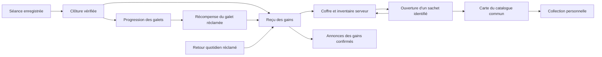

# Cartes — finir le branchement des trois familles

18 septembre 2026. **Plan initial désormais implémenté et déployé après les « go ».**
État actuel : [preuves](integration-2026-09-18/README.md).
Deux manèges distincts, orange/noir, stocks et reprises séparés.
14 références publiées ;28 API Cartes et35 régressions gains PASS.
Dernier parcours iPhone et shiny animé ouverts. Le texte ci-dessous conserve
le contexte du plan initial.
Complément demandé : **raccorder coffre, annonces, galets et récompenses**.
Ordre de livraison et matrice complète dans « Raccordement obligatoire » ci-dessous.

## Ce qui est arrêté

- Trois familles, 14 références d’atelier : Forêt des Veilles (4), Cimes Éteintes
  (6, dont deux paysages communs), Bois Sans Lune (4 : clairière v2, créatures v3).
  Source : `familles-2026-09-18.json`, noms FR/EN et SHA-256 des PNG originaux.
- Une référence = même illustration, nom localisé, rareté et finition pour tous.
  Les exemplaires et souvenirs de séance sont personnels. Deux scènes du même
  personnage sont deux références, jamais un faux doublon.
- Corbeau, chauve-souris et loup reconnaissables entre Cimes et Bois ; conserver
  visage, proportions et détails, changer pose, angle, action et interaction
  avec le décor. Ne pas simplement recolorer ou changer le fond.
- Full art, cadre actuel, lunes de rareté, texte blanc minimal, manège conservé.
  Les manquantes gardent leurs emplacements vides, sans image ni nom révélé.
- Le sachet noir garantit toujours une légendaire. Comparaison entre amis,
  échanges, nouvelles familles et chapitre Compte sont hors de cette livraison.
- Les PNG ont des reflets peints. Le shiny animé reste à réaliser et mesurer ;
  il ne doit pas retarder un catalogue fiable ni devenir la seule belle récompense.

## Point de départ vérifié, pas une nouvelle mesure serveur

Lecture et preuves des17–18 septembre : `ANALYSE-CARTES-2026-09-17.md`,
`integration-2026-09-18/schema-avant.json` et page documentaire `#forge`.
Le catalogue alors lu contient9 images,28 exemplaires et aucune des14 nouvelles
références. `cards` et `user_cards` existent, ainsi que la relecture de collection
et le cache disque. Ces mécanismes sont à prolonger, pas à recréer.

Défauts à traiter : la collection regroupe par famille ; `card_id` se perd dans
le rendu ; scellement du sachet puis insertion de l’exemplaire sont séparés ;
35 % des tirages demandent une nouvelle création, ainsi qu’une rareté vide ;
les totaux du profil sont en dur. La reprise serveur des sachets non scellés a
une fenêtre de6h, insuffisante pour une reprise durable. Une image décorative
peut apparaître avant la véritable réponse. Aucune correction de ces points ici.

## 1. Préparer le catalogue de lancement

Revoir les14 PNG sous le cadre réel, en petite vignette et sur iPhone : marges
d’ailes/bois, médaillon, contraste de nuit, croissant homogène. Vérifier en
particulier l’anatomie de la chauve-souris suspendue et les noirs de la clairière.
La sélection artistique est faite ; cette QA technique reste ouverte.

Étendre le catalogue existant avec une référence stable et les propriétés :
monde, collection, personnage éventuel, noms FR/EN, rareté, finition,
chemins des ressources immuables, empreinte et statut brouillon/publié/retiré.
La clé éditoriale du manifeste sera mappée à un `card_id` serveur ; ne pas la
confondre avec un UUID déjà déployé. Les variantes normale/shiny éventuelles
ont deux références liées au même personnage. Pas de loterie shiny supplémentaire
implicite : désigner les références qui portent cette finition avant publication.

Publier les ressources avant d’activer leurs références, vérifier leur accès,
les quatre raretés disponibles et les totaux. Ne jamais écraser un fichier
possédé. Une carte retirée des tirages reste lisible par ses propriétaires.
Les cartes historiques conservent leurs identifiants, images et exemplaires ;
aucune fusion automatique par famille ou ressemblance.

**Preuve de sortie :** manifeste publié relu, images/hash vérifiés, chaque rareté
serviable, zéro exemplaire ancien perdu. Les accès administratifs voient le
catalogue ; le profil ne reçoit que les cartes possédées et les totaux nécessaires.
L’absence de spoiler dans l’interface n’est pas une promesse de secret absolu :
le bucket historique est public. Protéger les nouveaux brouillons et décider
explicitement des droits de lecture des nouveaux arts avant publication.

## 2. Rendre l’attribution atomique et rejouable

Une opération serveur doit vérifier le compte et le sachet, reprendre son
résultat si déjà attribué, choisir uniquement une référence publiée, puis
sceller, créer l’exemplaire et avancer les garanties dans une même transaction.
Verrouiller dans un ordre constant le joueur puis le sachet : deux appareils
ne doivent pas contourner les compteurs ou consommer deux sachets pour un même
geste. Une contrainte d’unicité relie l’acquisition à son sachet ; une clé de
requête idempotente couvre aussi le choix du sachet avant que son ID soit reçu.

Conserver la garantie noire et le prix déjà gérés. La provenance de séance
vient du serveur, jamais d’un `workout_id` cru dans la requête cliente. Les
sachets de conversion sans origine de séance gardent une provenance honnête.
Un catalogue vide/refus réseau avant attribution ne doit pas dégrader la rareté
promise ou perdre le sachet. Une panne après commit permet de relire le même
résultat ; après rollback, aucun gain ni compteur partiel. Prévoir une reprise
au-delà de6h, et une réparation auditée des éventuels anciens sachets scellés
sans exemplaire, en conservant leur `card_id` et sans double attribution.

Séparer l’atelier IA du tirage des utilisateurs. L’atelier crée et fait valider
les illustrations ; l’ouverture distribue celles déjà publiées. Supprimer la
création aléatoire pendant le manège uniquement lors de ce futur branchement.

**Preuve de sortie :** même sachet rejoué/concurrent = même carte et un seul
exemplaire ; panne injectée aux étapes critiques = tout ou rien ; garantie noire
respectée ; reprise ancienne sans perte ; aucune écriture client directe.

## 3. Relier le résultat jusqu’à la collection

Transporter `card_id`, famille, personnage, noms localisés, rareté, finition,
ressources et identité de l’exemplaire jusqu’au dévoilement puis au profil.
Adapter `ForgeServeur`, `LuneForge.Carte`, les modèles de carte reçue,
`BoosterLab`, `CollectionLune` et `ma_collection()` ensemble. Prévoir la
compatibilité des anciens clients pendant le déploiement, par contrat versionné
ou déploiement additif avant bascule ; ne pas changer silencieusement leur forme.

Compter les doublons par `card_id`, les exemplaires par acquisition. Le cache
existant se clé par référence/empreinte, pas seulement par famille ; le vider
ne détruit aucune propriété. Purger l’état d’affichage au changement de compte.
Les totaux viennent du catalogue publié, restent cohérents quand il évolue et
ne provoquent pas une plage négative si une ancienne collection dépasse un total.

Le manège révèle uniquement la carte réellement attribuée. Si le téléchargement
échoue après attribution, afficher l’attente/reprise du même résultat : aucune
fausse carte acquise, aucune nouvelle dépense. Déconnexion, réinstallation et
nouvel appareil doivent retrouver la même collection depuis le serveur.

**Preuve de sortie :** deux comptes possèdent la même référence et les mêmes
pixels, tout en ayant des collections séparées ; un même personnage dans deux
mondes reste deux cartes ; relance/réinstallation retrouvent les acquisitions ;
les manquantes sont vides et les libellés FR/EN désignent la même référence.

## 4. Un rythme généreux pour quelques séances par semaine

**Candidat à simuler, pas un barème actif ni une décision déployée.** Il remplace
le candidat historique6/12 ouvertures et6séances du premier plan.

- Poids de base proposés :45 % communes,35 % rares,15 % épiques,5 % légendaires.
- Première ouverture ordinaire : rare ou mieux ; jamais plus de deux communes
  ordinaires consécutives. Si une garantie légendaire est acquise, elle prime.
- Première légendaire : au plus tard au6e booster ordinaire, ou à la prochaine
  ouverture ordinaire après2séances éligibles distinctes, première borne atteinte.
- Ensuite : au plus tard au8e booster ordinaire depuis la dernière légendaire,
  ou à la prochaine ouverture ordinaire après3séances éligibles sans légendaire.
- Les séances comptent à leur clôture serveur vérifiée ; un rejeu de clôture ne
  recompte pas. Utiliser les vrais critères d’éligibilité des gains, sans changer
  le barème des séances. La nouvelle protection ne doit pas récompenser des UUID
  de séances inventés : la validation de clôture est une dépendance de production.
- Une ouverture réussie avance une seule fois ses compteurs. La légendaire
  effectivement attribuée, y compris noire, satisfait la garantie d’accueil et
  remet à zéro l’attente de légendaire. Le noir ne compte pas comme ouverture
  ordinaire. Compteurs persistants côté joueur ; absence, erreur et réinstallation
  ne les effacent pas. Pas de perte de progression liée aux jours sans sport.
- Les séances terminées avant la dernière attribution ne sont pas reportées
  dans le cycle suivant. Un joueur peut stocker ses sachets : la garantie existe
  à la prochaine ouverture, elle ne prétend pas attribuer automatiquement une carte.

En ouvrant au moins un booster après chaque séance éligible, les bornes proposées
sont : première légendaire en2séances maximum, suivantes en3séances maximum.
À1séance/semaine :2puis3semaines au maximum ; à2séances/semaine :1puis1,5semaine
en rythme régulier ; à3séances/semaine : au plus une semaine entre légendaires.
Les séances longues avec plusieurs boosters peuvent atteindre la borne par
ouvertures plus tôt. Ce sont des plafonds conditionnels calculés, pas des mesures
joueur ni des dates garanties en cas d’interruption ou de sachets non ouverts.

Le catalogue retenu ne contient que3légendaires. Proposer une priorité aux
légendaires encore manquantes jusqu’à avoir découvert les3, puis des doublons
normaux ; cette proposition ne change pas les références partagées entre joueurs.
Simuler avant fixation :1/2/3séances par semaine, petits gains/cardio/séances
longues,1/2/3/5boosters, noirs, stock non ouvert, absences et vrais doublons.
Rapporter médiane/p95/maximum avant légendaire, taux effectif par rareté, nouvelles
cartes par séance et temps pour découvrir les14. Le chiffre historique11,10 %
concerne un autre modèle et ne doit pas être réutilisé pour celui-ci.

L’attachement vient de belles découvertes, personnages familiers et souvenirs.
Ne pas ralentir artificiellement les légendaires pour compenser un petit catalogue.
Le lancement peut rester modeste ; son extension éditoriale vient ensuite.

## 5. Shiny et QA avant le verdict final

Réutiliser foil/tilt existants, puis un éveil bref sur la carte visible seulement.
Finition officielle partagée, poster immobile, arrêt hors écran/recouverte/en
arrière-plan, Reduce Motion et protections thermiques. Charger le skill chauffe
avant toute réalisation. Pas de grille animée en permanence. Mesurer le supplément
sur iPhone après repos et comparer au même parcours sans l’effet.

La QA finale couvre compte neuf et existant, deux comptes séparés, même référence,
doublons, FR/EN, absence d’accès croisé, tentative d’écriture directe, stock noir,
concurrence, coupure avant/après attribution et téléchargement, reprise après6h,
déconnexion/réinstallation, catalogue vide, ancienne version cliente et rollback.
Tester sur comptes QA dédiés ; ne pas remettre le compte personnel à zéro.

Déployer d’abord les changements additifs et ressources vérifiées ; basculer le
tirage sous règle serveur réversible, puis le client compatible. Une désactivation
suspend les nouveaux tirages sans effacer les cartes déjà attribuées. Relever les
erreurs d’attribution, reprises, latence et écarts collection/sachets. Aucune clé
privilégiée dans l’app ; droits et RLS testés avec deux identités réelles.

**« Tout est bon » seulement après preuves du parcours réel.** Aujourd’hui : art
retenu, galerie documentaire produite ; branchement, cadence, rendu iPhone et
shiny animé encore à faire. Les résultats vont dans les briques/mesures du site,
source et livrable ensemble. Le contrôle de chauffe débranché et l’haptique de
l’île restent des validations distinctes, encore ouvertes dans leur chapitre.

## Raccordement obligatoire : galets, gains, coffre, annonces

Complément demandé par Kathryn après le scellement des trois familles. Le but
est un parcours complet : une récompense gagnée sur un galet ou après une séance
entre dans le même inventaire, produit son reçu, puis ouvre une vraie carte.
Une animation de gain, un grattage ou un toaster ne crée jamais de propriété.

### Ordre de livraison et dépendances

| Lot | À livrer | Condition pour passer au suivant |
| --- | --- | --- |
| P0 — gains et galets fiables | Clôture après synchronisation complète ; progression et droit au galet vérifiés côté serveur | Séance inexistante/étrangère/incomplète refusée sans gain ; rejeu normal conservé ; galet futur refusé |
| P1 — contrat partagé | Reçus stables, vrais identifiants de sachets, provenance, catégorie/garantie et état du coffre | Chaque entrée, conversion et reprise est traçable de sa cause à son stock |
| P2 — catalogue officiel | Les 14 références retenues après QA du cadre, noms FR/EN et ressources immuables | Aucune référence publiée sans ressource disponible ; anciennes cartes conservées |
| P3 — ouverture fiable | Attribuer la référence, sceller le sachet, écrire l’exemplaire et les compteurs atomiquement | Une ouverture rejouée/concurrente garde le même résultat ; tous les noirs garantis |
| P4 — raccords des écrans | Route, grattage, story, annonces, coffre, manège et profil lisent ces mêmes résultats | Nombres et identités cohérents entre tous les écrans, sans gain fictif |
| P5 — QA commune et activation | Tests de toutes les origines, deux comptes, réseau et reprise ; suivi des erreurs | Chaque ligne du scénario ci-dessous a une preuve API et, lorsque pertinent, iPhone |

P0 est déjà travaillé par la session Compte/gains/progression dans
`20260918083033_compte_gains_et_progression.sql` et les appels Swift associés.
Sa présence dans l’arbre de travail ne prouve pas son déploiement. Relire son
état et ses preuves au moment du raccordement, sans écrire un second correctif
concurrent. P1/P2 peuvent être préparés en parallèle ; aucune activation en
production avant P0 et la QA des opérations combinées.

### État des jonctions, lu le 18 septembre

| Jonction | Ce qui existe | Ce que cette livraison doit fermer |
| --- | --- | --- |
| Séance → gains | `OutboxGains`, `cloturer_seance`, barèmes muscu/cardio et conversion automatique | Attendre la synchronisation complète, exploiter le résultat autoritaire et reprendre sans double paiement |
| Galet → récompense | `tirer_noeud_chemin`, index de claims, `RewardChemin`, lecture des nœuds réclamés | Reprendre le droit serveur de P0 ; conserver le résultat exact et les IDs des sachets, pas seulement leurs robes |
| Gain → coffre | `etat_coffre`, `historique_gains`, `EconomieWoop` | Stock par catégorie, reprises durables, état appliqué une fois même avec des réponses dans le désordre |
| Gain → annonce | `FileAnnonces` et la pilule issue de l’île | Identité économique stable, attente de confirmation et déduplication après rejeu/reconnexion |
| Noir du galet → légendaire | La route écrit `robe='noire'` avec `origine='chemin'` ou `'cadeau'` | `forge-card` ne force actuellement la légendaire que pour `origine='legendaire'` : contrat incomplet constaté dans le code, non reproduit en API par cette passe |
| Sachet → collection | Ouverture, scellement, `user_cards`, relecture et cache | Une transaction d’attribution et `card_id` conservé jusqu’au profil |

Le défaut noir du chemin est visible dans les sources :
`20260830160000_sachet_scelle_et_tirage.sql` construit les robes puis écrit
`chemin/cadeau` ; `forge-card/index.ts:199–228` ne lit pas `robe` et ne garantit
que l’origine `legendaire`. De même, `etat_coffre` compte les origines autres
que `legendaire` dans `boosters_or`. Ne pas étendre la preuve historique du noir
acheté avec de l’argent aux noirs offerts par les galets. Leur rendu, leur
classement, leur ouverture et leur garantie doivent être vérifiés ensemble.

### A. Un reçu stable pour chaque opération

Faire évoluer les contrats existants, sans refaire un second portefeuille.
Les noms suivants sont une proposition de contrat, pas des champs déjà déployés :
`operation_id`, `receipt_id`, `event_id`, `inventory_version`, `booster_id`.

Chaque mutation rend son résultat enregistré : origine, clé de cause, montants
réellement crédités/débités, sachets créés avec leurs IDs et catégorie, résultat
de progression si concerné, état du coffre après opération, indicateur de rejeu.
La story WIN, le journal et les annonces utilisent ce même reçu. Le rejeu conserve
le résultat historique et relit si nécessaire un état du coffre plus récent ;
il ne recrédite rien et ne réapplique pas un ancien instantané sur un plus neuf.

La cause est unique : séance UUID ; jour serveur pour le retour quotidien ;
identité serveur du nœud pour le claim ; conversion rattachée à son crédit ;
sachet UUID pour l’acquisition d’une carte. La clé de requête cliente complète
ces contraintes, elle ne les remplace pas : changer de clé ne permet pas de
rejouer un galet ou un gain de séance. L’utilisateur vient de la session vérifiée.

L’identifiant actuel d’un nœud est un entier global. Le garder pour les cinq
chapitres existants ; prévoir une version de parcours si un nouveau parcours
réutilise un jour les rangs. Ne pas décider ici d’une saison ou d’un reset.
Les claims existants restent acquis même si la progression est recalculée.

Crédit, conversion, création du stock et reçu appartiennent à une transaction.
L’ouverture ultérieure est une autre transaction, courte. Aucune transaction
SQL n’attend le manège, le grattage, un téléchargement ou l’API d’images.
Adopter un ordre de verrous commun aux mutations d’un joueur, y compris crédits,
conversions, claims noirs et ouvertures ; tester leurs combinaisons concurrentes.

### B. Distinguer origine, catégorie, rareté et finition

| Propriété | Exemple | Autorité |
| --- | --- | --- |
| Origine du sachet | séance, conversion, chemin, cadeau, argent dépensé | Écriture serveur qui a créé le sachet |
| Catégorie/garantie du sachet | ordinaire ; noir à légendaire garantie | Contrat serveur du sachet, rendu par sa robe |
| Rareté de la carte | commune, rare, épique, légendaire | Attribution serveur selon catégorie et protections |
| Finition de la référence | normale ou shiny officielle | Catalogue publié, identique chez tous |

Un sachet noir offert par un galet est déjà possédé : **zéro pièce d’argent à
payer pour l’ouvrir**. La conversion d’une pièce d’argent en noir est une action
distincte, via le mécanisme de claim existant. Son rejeu reprend le noir déjà
créé ; il ne débite pas une seconde fois. L’orange donné par séance, conversion
ou galet conserve le tirage ordinaire et les mêmes protections Cartes.

Migrer les garanties des sachets existants d’après les faits persistés : noir
pour `origine='legendaire'` ou robe noire d’un claim validé. Ne pas croire une
robe envoyée par l’iPhone. Conserver la provenance originale et les images des
cartes déjà scellées. Examiner séparément les noirs historiques déjà ouverts
ayant reçu une autre rareté avant toute éventuelle compensation : aucun
remplacement ni crédit correctif automatique autorisé par ce plan.

Le résultat « rare » du grattage peut désigner un lot orange+noir ; ce n’est
pas une carte rare déjà possédée. La carte n’entre dans la collection qu’à
l’attribution du sachet. Une collection n’augmente pas au simple claim du galet.

### C. Le coffre reste la lecture commune du stock

Étendre `etat_coffre` de façon compatible : soldes or/argent, sachets ordinaires
possédés, noirs possédés, ouvertures à reprendre et possibilités de convertir
l’argent doivent être identifiables. Un noir déjà possédé, un noir en cours
et le droit d’en créer un avec de l’argent ne doivent jamais être comptés deux
fois. À stock multiple, ouvrir l’ID choisi ou la prochaine réserve éligible du
même type ; le type, la robe montrée et la carte attribuée doivent correspondre.

Conserver les quatre portes du profil vers le coffre et le manège existant.
Le bouton « Ouvrir » utilise le stock serveur ; il ne recrée pas l’ancien achat
orange à100pièces. La conversion automatique existante reste l’unique voie de
conversion : aucun calcul local supplémentaire après la réponse.

Appliquer les instantanés par version croissante dans le store commun du compte.
Un rafraîchissement commencé avant un claim puis arrivé après ne doit pas effacer
le nouveau stock. Annuler/ignorer les retours de l’ancien compte. Après ouverture,
mettre à jour le coffre ET la collection ; si l’image manque, garder l’acquisition
et proposer de reprendre son chargement. Au-delà de6h, une ouverture non terminée
reste accessible et n’est pas comptée à la fois comme disponible et nouvelle.

Rendre des IDs stables dans `historique_gains` : une identité dérivée seulement
de la date, du montant et du motif ne suffit pas pour relier sans ambiguïté le
journal, les annonces, les conversions et les ouvertures simultanées.

### D. Les annonces confirment ; elles ne paient pas

Réutiliser la file et le morph de la pilule. Aucun nouveau dessin, moteur,
rythme haptique ou Live Activity requis par ce raccordement. L’haptique ressentie
et la chauffe restent des contrôles séparés.

Une annonce de gain porte l’`event_id` du reçu confirmé. Deux gains légitimes de
20pièces ont deux IDs ; deux réponses du même gain gardent le même ID. Dédupliquer
par compte, pas par texte ou montant. Le journal de gains reste consultable même
si le joueur ferme l’annonce, tue l’app ou ne regarde pas la story.

Prévoir une livraison persistante minimale des événements et un accusé de
présentation, avec contrôle du propriétaire. Éviter une nouvelle infrastructure
si les reçus suffisent. Après relance, présenter les reçus encore pertinents sans
inonder l’écran d’anciennes animations ; les autres restent dans l’historique.
Un crash entre affichage et accusé peut laisser une présentation incertaine :
garantir le gain unique et la reprise du reçu, sans promettre une animation
« exactement une fois » dans toutes les coupures possibles.

Le Welcome Back ne doit plus annoncer « +10 reçu » avant confirmation. Le code
actuel `reclamerRetour()` pousse le toaster avant le réseau ; garder une attente
ou un état à synchroniser jusqu’au vrai résultat. Un « déjà pris » depuis un autre
appareil met le coffre à jour et ne produit pas un nouveau gain.

`RewardChemin.fermer()` produit actuellement une annonce à partir du tirage
affiché, sans identité persistante d’événement. Relier sa fermeture au reçu du
claim ; rouvrir puis refermer une récompense ancienne ne doit pas annoncer une
nouvelle attribution. Le grattage et le reçu après grattage peuvent montrer le
même gain comme prévu, sans constituer deux opérations économiques.

À la clôture : appliquer les faits/gains confirmés, laisser la story les lire,
puis vider la file d’annonces après la story. La destination Route et son prochain
galet utilisent la progression confirmée de P0. Si la réponse arrive tard,
raccrocher le reçu au même workout sans rejouer toute la story ni relancer des
gains déjà vus. Le bouton qui invite à ouvrir utilise uniquement un stock acquis.

### E. Les protections Cartes suivent les vraies séances

La progression Route et l’éligibilité économique peuvent différer : un effort
court peut compter pour le chemin sans atteindre un seuil de paiement cardio.
Rendre ces décisions explicitement côté serveur ; ne pas déduire l’éligibilité
Cartes du numéro de galet affiché, du calendrier ou du nombre de pop-ups.

Pour le candidat actuel, compter une seule fois les séances éligibles aux gains
qui alimentent les sachets. Plusieurs boosters d’une longue séance font avancer
le compteur d’ouvertures, pas plusieurs fois le compteur de séances. Un retour
quotidien, un galet réclamé et une conversion ne sont pas de nouvelles séances.
Deux séances distinctes le même jour restent deux séances si le contrat serveur
les déclare éligibles ; la flamme quotidienne est une autre mesure.

Les ouvertures ordinaires comptent quelle que soit l’origine de leur sachet.
Une légendaire attribuée depuis un noir de galet satisfait aussi la garantie et
réinitialise l’attente, comme celle obtenue grâce à l’argent. Recevoir un noir
sans l’ouvrir ne remet pas encore l’attente à zéro. Le catalogue partagé et les
protections ne dépendent pas d’un texte généré ou de la durée du manège.

### F. Scénarios de sortie communs

Les chiffres ci-dessous sont des fixtures de test, avec règles figées pour le
banc ; ce ne sont pas des gains injectés dans le compte personnel.

| Cas | Preuve attendue de bout en bout |
| --- | --- |
| Compte neuf | Premier galet, aucun claim anticipé, coffre et collection vides, aucune annonce inventée |
| Clôture muscu,10séries,solde initial0 | Sous le barème20/100 :200pièces gagnées,2conversions+1forfaitaire ;3IDs de sachets,solde0 ; même reçu dans story, journal et annonces ; rejeu = aucun gain de plus |
| Crédit de galet150,solde80 |230disponibles avant conversion ;2sachets créés,solde30 ; annonce du crédit et des conversions liées au même reçu, jamais4sachets |
| Cardio sans muscu | Bon barème et sachet selon l’éligibilité réelle ; aucun faux calcul séries×20 ; reprise identique |
| Galet verrouillé / étranger | Claim refusé, zéro écriture de gain, zéro annonce de succès ; ancien claim autorisé à relire |
| Galet orange+noir |2sachets distincts, correctement classés dans le coffre ; ouvrir le noir donne1légendaire, sans débit argent ; l’orange reste ouvrable |
| Galet noir+noir |2IDs noirs, chacun ouvre sa légendaire ; aucune pièce d’argent nécessaire et aucune fusion des exemplaires |
| Argent → noir | Débit du prix serveur une fois ; même noir repris après coupure ; garantie légendaire |
| Retour quotidien simultané sur2appareils |1crédit et conversions correspondantes ; pas de second gain annoncé pour « déjà pris » |
| Clôture + claim galet simultanés | Conversions et stock égaux au carnet, reçus distincts ; aucune perte due à une réponse tardive |
| Double tap /20appels concurrents sur1sachet |1acquisition et1avance de compteur ; réponse identique au rejeu ; pas de consommation du suivant |
| Coupure avant/après validation,grattage,ouverture et image | Reprendre le même résultat, stock visible après6h, aucune carte décorative enregistrée, journal intact |
| Rouvrir une récompense réclamée | Même résultat relu ; pas de nouveau crédit ni nouvelle annonce de gain |
| Deux comptes,reconnexion,réinstallation | Même référence = mêmes pixels ; inventaires/exemplaires/annonces isolés ; acquis retrouvés ; manquantes vides |
| Garantie2/3séances et6/8ouvertures | Simulation et tests avec toutes les origines ; un gain de galet n’est pas une séance supplémentaire ; aucun compteur avancé au rejeu |

Pour chaque scénario : conserver IDs de séance/nœud/opération/sachets/cartes,
lectures du carnet avant/après, réponses RPC, état coffre, collection et événements
annoncés. Utiliser des comptes QA, des fixtures locales de tirage et le stock
existant sans forcer des résultats via une manette accessible en production.

Activer par étapes après ces preuves : schéma/contrats compatibles, publication
vérifiée, clients capables de lire les IDs, puis nouveau tirage. Les anciens
clients encore supportés doivent soit recevoir un contrat compatible, soit être
invités à mettre à jour avant cette ouverture ; ils ne doivent pas contourner la
garantie par l’ancienne route. Le retour arrière suspend les nouveaux tirages et
conserve toutes les propriétés, reçus et reprises déjà enregistrés.

La validation d’une RPC seule ne ferme pas ce lot. Pour déclarer la chaîne prête,
coffre, annonces, Route et Cartes doivent être relus sur les mêmes événements
réels, avec la version app et backend identifiée. Renseigner la mesure transversale
`m-cartes-chaine-rewards` et le défaut `b-fo-noirs-chemin` dans la documentation.

Sources locales complémentaires : `RewardChemin.swift:190–305`,
`EconomieNosfy.swift` (`appliquer`, `reclamerRetour`, `consommerBooster`),
`SacreServeur.swift` (`EtatCoffre`, `ClotureSeance`, `tirerNoeudChemin`,
`ouvrirBooster`), `Annonces.swift:28–110`, `OutboxGains.swift` et migrations
`20260830160000`, `20260830210000`, `20260915190000`.
Pour les privilèges et les verrous, relire les références Supabase ci-dessous
et la [documentation PostgreSQL](https://www.postgresql.org/docs/current/explicit-locking.html) :
les verrous se prennent dans un ordre cohérent et les transactions restent courtes.

## Références de mise en œuvre à relire

- `Nosfy/Services/ForgeServeur.swift`, `Nosfy/Views/BoosterLab.swift`,
  `Nosfy/Views/SacreAccueil.swift` et `supabase/functions/forge-card/index.ts`.
- `ANALYSE-CARTES-2026-09-17.md` et le manifeste des familles.
- [RLS Supabase](https://supabase.com/docs/guides/database/postgres/row-level-security) :
  droits SQL et politiques par propriétaire se vérifient ensemble.
- [Fonctions de base de données](https://supabase.com/docs/guides/database/functions) :
  cadrer les privilèges du point d’entrée ; ne pas exposer une écriture privilégiée
  sans contrôle d’identité. Documentation consultée le18-09, à relire à l’implémentation.
