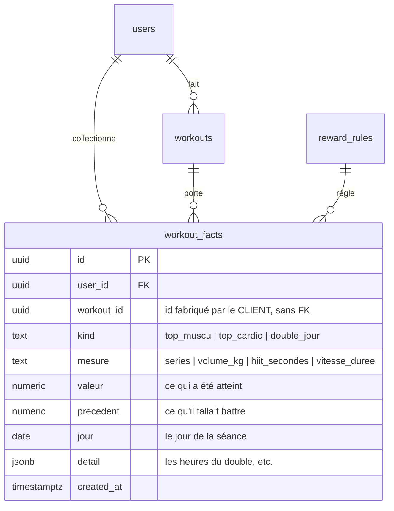

# PROPOSITION BACK-END — LE MOTEUR DE FAITS

**30-08.** Ses règles, dictées : « une story muscu et cardio particulière qui
arrive quand le user a fait une séance où il **s'est dépassé** — on prend la
meilleure de la semaine. Exemple : plus de séries ou plus de poids levé ; et
cardio, plus longtemps au HIIT ou de plus grande vitesse plus longtemps. Et la
deuxième séance, c'est **deux séances la même journée** — il faut inscrire ça. »

Analyse préalable : `ANALYSE-VARIANTS-ET-FAITS.md` (les quatre variants sont
écrits, aucun n'est déclenché). Décision déjà prise au § 6 bis : **l'app
calcule, le serveur RANGE.**

---

## 0 · Les quatre décisions que cette proposition applique

**① « Se dépasser » = battre SA semaine sur AU MOINS UNE mesure de son sport.**
C'est sa phrase, et elle est plus juste qu'un score unique : une séance courte
mais très lourde se dépasse autant qu'une longue et légère.

| sport | mesures — il suffit d'en battre **une** |
|---|---|
| 🏋️ **muscu** | le nombre de **séries** · le **poids levé** (volume, en kg) |
| 🏃 **cardio** | les **secondes de HIIT** · la **vitesse × durée** (aller plus vite, plus longtemps) |

**② On garde QUELLE mesure a été battue.** Sans ça, la page TOP peut dire « tu
t'es dépassée » mais pas *en quoi* — et c'est précisément ce qui fait qu'on la
regarde. On range donc la mesure, la valeur atteinte, et **ce qu'il fallait
battre**.

**③ Un fait est un ESTAMPILLAGE, pas un classement vivant.** Une séance qui a
été la meilleure de sa semaine **le reste**, même si une autre la dépasse le
surlendemain. C'est déjà la loi des dates du chemin (« les jours apparaissent le
jour où le user a terminé »), et elle évite l'absurdité d'une story qu'on a vue
et qui deviendrait fausse après coup.

**④ La fenêtre, les mesures et le sport vivent en base**, pas dans du Swift —
la loi de la maison : *l'app les LIT, elle ne les connaît pas*.

---

## 1 · Diagramme conceptuel



⚠️ **`workout_id` n'a PAS de clé étrangère, et c'est voulu** — exactement comme
`coin_ledger.workout_id`. Les faits partent par l'**outbox**, donc ils peuvent
arriver **avant** que la séance elle-même n'ait été poussée. Une FK ferait
échouer l'écriture d'un fait pour une raison qui n'a rien à voir avec lui.

---

## 2 · Dictionnaire des données

<details><summary><b>workout_facts</b> — un fait remarquable sur une séance</summary>

| colonne | type | nul | défaut | à quoi ça sert |
|---|---|---|---|---|
| `id` | `uuid` | non | `gen_random_uuid()` | la ligne |
| `user_id` | `uuid` | non | — | à qui c'est arrivé (FK `auth.users`, `on delete cascade`) |
| `workout_id` | `uuid` | non | — | la séance concernée. **Sans FK** (voir § 1) |
| `kind` | `text` | non | — | `top_muscu` · `top_cardio` · `double_jour`. Un `check` le tient |
| `mesure` | `text` | **oui** | — | **en quoi** elle s'est dépassée. Vide pour un `double_jour` : il n'y a rien à battre, il y a deux séances |
| `valeur` | `numeric` | oui | — | ce qu'elle a atteint (12 séries, 4 280 kg, 900 s de HIIT…) |
| `precedent` | `numeric` | oui | — | ce qu'il fallait battre. C'est lui qui permet d'écrire « 12 séries, ton record de la semaine était 9 » |
| `jour` | `date` | non | — | le jour de la séance. Il porte l'unicité du `double_jour` |
| `detail` | `jsonb` | non | `'{}'` | ce que la page a besoin de dire et qui ne rentre pas dans un nombre — pour le ×2 : `{"heures":["07:12","19:40"],"minutes":114}`, **exactement ce que `DoubleFait` attend déjà côté app** |
| `created_at` | `timestamptz` | non | `now()` | quand le fait a été rangé (≠ le jour de la séance) |

</details>

**Les trois index, et ce que chacun empêche :**

| index | empêche |
|---|---|
| `unique (user_id, workout_id, kind)` | qu'une même séance porte deux fois le même fait — **c'est l'idempotence**, et c'est ce qui rend le rejeu de l'outbox sûr |
| `unique (user_id, jour) where kind = 'double_jour'` | qu'un jour ait deux « deuxièmes séances ». La troisième séance du jour ne crée pas un second ×2 |
| `(user_id, jour desc)` | la lecture : « les faits de cette semaine », « ceux de ce jour » |

---

## 3 · Les règles, en base

```sql
('top_mesures_muscu',   '["series","volume_kg"]')
('top_mesures_cardio',  '["hiit_secondes","vitesse_duree"]')
('top_fenetre_jours',   '7')     -- la « semaine » glissante
('top_min_seances',     '2')     -- pas de « meilleure de la semaine » sur une seule séance
```

⚠️ **`top_min_seances` n'est pas un détail** : sans lui, la PREMIÈRE séance de
la semaine est mécaniquement la meilleure, et la page TOP se déclencherait un
lundi sur deux pour une séance ordinaire. Se dépasser suppose un précédent.

---

## 4 · Scripts DDL

<details><summary><b>Le DDL complet</b> (à copier, pas à lire)</summary>

```sql
create table if not exists public.workout_facts (
  id          uuid primary key default gen_random_uuid(),
  user_id     uuid not null references auth.users(id) on delete cascade,
  workout_id  uuid not null,
  kind        text not null,
  mesure      text,
  valeur      numeric,
  precedent   numeric,
  jour        date not null,
  detail      jsonb not null default '{}'::jsonb,
  created_at  timestamptz not null default now(),
  constraint workout_facts_kind_check check (kind in (
    'top_muscu','top_cardio','double_jour')),
  constraint workout_facts_mesure_check check (mesure is null or mesure in (
    'series','volume_kg','hiit_secondes','vitesse_duree'))
);

alter table public.workout_facts enable row level security;
create policy "chacun ne voit que ses faits" on public.workout_facts
  for select to authenticated using (auth.uid() = user_id);

create unique index if not exists workout_facts_unique
  on public.workout_facts (user_id, workout_id, kind);

create unique index if not exists workout_facts_double_jour_unique
  on public.workout_facts (user_id, jour)
  where kind = 'double_jour';

create index if not exists workout_facts_user_jour_idx
  on public.workout_facts (user_id, jour desc);

-- L'ACTE : « cette séance est close, voici ses faits ». Une fonction par acte,
-- pas par table — un fait seul n'a pas de sens.
create or replace function public.poser_faits_seance(
  p_workout uuid,
  p_jour    date,
  p_faits   jsonb          -- [{"kind":…, "mesure":…, "valeur":…, "precedent":…, "detail":{…}}]
) returns jsonb
language plpgsql security definer set search_path = public as $$
declare
  f jsonb;
  v_poses integer := 0;
begin
  if p_workout is null or p_jour is null then
    raise exception 'poser_faits_seance : il faut la séance et son jour';
  end if;

  for f in select * from jsonb_array_elements(coalesce(p_faits, '[]'::jsonb))
  loop
    begin
      insert into public.workout_facts
        (user_id, workout_id, kind, mesure, valeur, precedent, jour, detail)
      values (auth.uid(), p_workout, f->>'kind', f->>'mesure',
              (f->>'valeur')::numeric, (f->>'precedent')::numeric, p_jour,
              coalesce(f->'detail', '{}'::jsonb));
      v_poses := v_poses + 1;
    exception when unique_violation then
      -- déjà rangé : ce n'est PAS une erreur. L'outbox doit pouvoir rejouer
      -- sans savoir.
      null;
    end;
  end loop;

  return jsonb_build_object('poses', v_poses);
end $$;

grant execute on function public.poser_faits_seance(uuid, date, jsonb)
  to authenticated;
```

</details>

⚠️ **Une erreur métier n'est pas une erreur serveur** : un fait déjà rangé rend
`{"poses": 0}` avec un **200**, jamais un 500. C'est ce qui permet à l'outbox de
rejouer sans savoir.

⚠️ **Le `check` de `kind` est écrit en entier** : le jour où on ajoute
`record_charge`, on recopie **la dernière liste**, pas la première — c'est le
piège qui a déjà rendu une migration inapplicable ici.

---

## 5 · Migration — Up / Down

**Up** : la table, ses trois index, la policy, la fonction, les quatre règles.
Aucune colonne ajoutée ailleurs, aucune fonction existante touchée : rien de ce
qui tourne aujourd'hui ne peut casser.

**Down** :

```sql
drop function if exists public.poser_faits_seance(uuid, date, jsonb);
```

⚠️ **Le Down retire la FONCTION, jamais les LIGNES.** Un fait rangé est arrivé ;
on ne rembobine pas ce qui s'est passé. C'est la même loi que le ledger.

---

## 6 · Ce que l'app fait, et ce qu'elle ne fait pas

À la clôture d'une séance, l'app :

1. lit les mesures de son sport dans `reward_rules` ;
2. compare la séance qui vient de finir aux `top_fenetre_jours` derniers jours
   (sa base locale, celle qui vient de s'entraîner) ;
3. si elle bat **au moins une** mesure et qu'il y a au moins `top_min_seances`
   séances dans la fenêtre → un fait `top_muscu` ou `top_cardio`, avec la
   mesure, la valeur et le précédent ;
4. si c'est la deuxième séance du jour → un fait `double_jour`, avec les heures
   et les minutes ;
5. **poste le tout par l'outbox** — donc sans attendre le réseau, et sans
   risque de perte ;
6. **ouvre la story tout de suite**, avec ces faits-là. Elle ne demande rien à
   personne.

Ce qu'elle ne fait pas : **elle ne relit pas** les faits pour décider. Le
serveur les RANGE ; ils serviront le deuxième téléphone, la réinstallation, et
plus tard les stickers et le chemin.

---

## 7 · Ce que ça débloque, dans l'ordre

| # | Ce qui s'allume | Coût |
|---|---|---|
| 1 | la page **×2** — le fait le plus simple, deux dates suffisent | ⏱️ |
| 2 | la page **TOP SESSION** muscu et cardio, avec la phrase qui dit *en quoi* | ⏱️ |
| 3 | la robe du butin, si elle se mérite au lieu de se tirer | ⏱️ |
| 4 | le sticker déduit d'un fait au lieu d'un modulo | ⏳ |
| 5 | le chemin, qui lira « ce jour-là a été fait » à la même source | ⏳ |

**Rien de tout ça n'est écrit.** Ce document est la proposition ; il attend son
« go » avant la première ligne de SQL.
